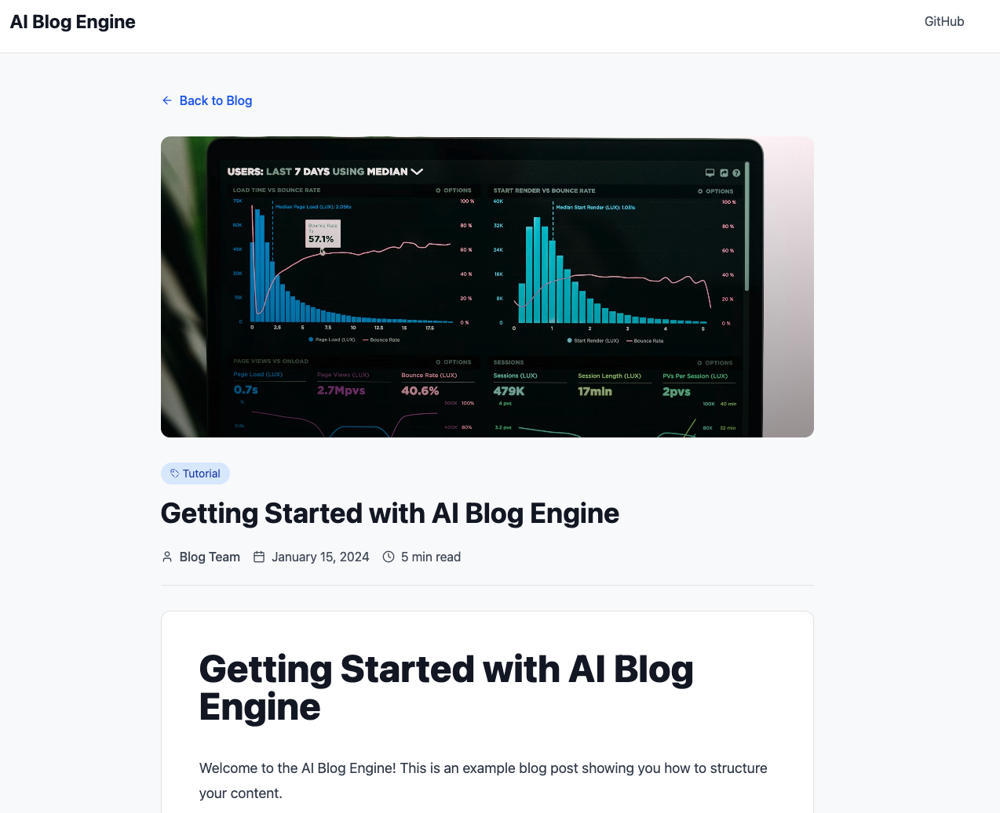
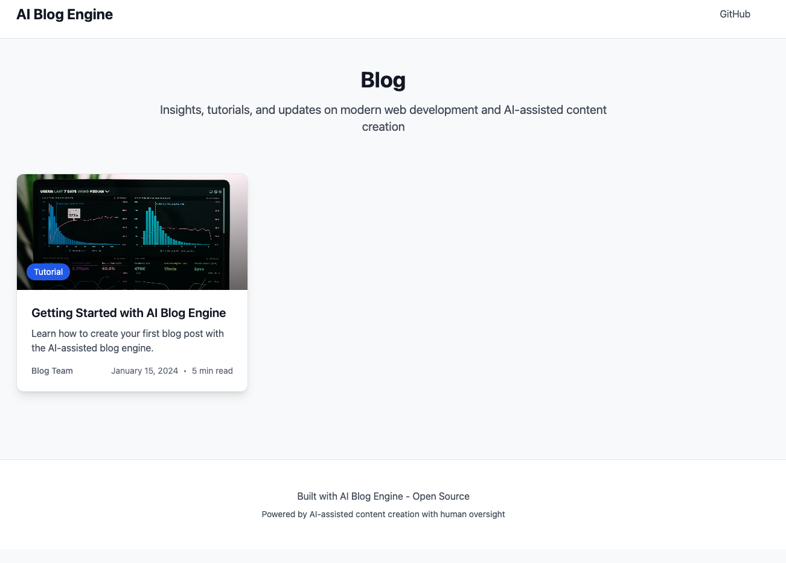

# AI Blog Engine

<p align="center">
  <strong>A Modern, AI-Assisted Blog Publishing System</strong>
</p>

<p align="center">
  <a href="#-features-at-a-glance">Features</a> •
  <a href="#-getting-started">Getting Started</a> •
  <a href="#-documentation">Documentation</a> •
  <a href="#-contributing">Contributing</a> •
  <a href="LICENSE">License</a>
</p>

<p align="center">
  
  
  
  
  
  
</p>

> This blog engine demonstrates responsible AI usage in content creation through a human-in-the-loop workflow. All content is AI-assisted but human-reviewed, edited, and curated to ensure accuracy, relevance, and quality.

---

## 📸 Screenshots

<p align="center">
  
  <br/>
  <em>Clean, modern blog listing with responsive card layout</em>
</p>

<p align="center">
  
  <br/>
  <em>Beautiful blog post renderer with syntax highlighting</em>
</p>

---

## ✨ Features at a Glance

- ✅ **Modern React Stack** - React 18, TypeScript, Vite, Tailwind CSS
- ✅ **Markdown-Based** - Write posts in simple Markdown with YAML frontmatter
- ✅ **AI-Powered Images** - Automated image generation with OpenAI + Google Gemini
- ✅ **SEO Optimized** - Automatic sitemap, robots.txt, and Schema.org structured data
- ✅ **Syntax Highlighting** - Beautiful code blocks with Prism
- ✅ **Responsive Design** - Mobile-first with smooth Framer Motion animations
- ✅ **WebP Optimization** - Automatic image conversion and compression
- ✅ **Zero Config** - Works out of the box with sensible defaults

---

## 🎯 Purpose & Philosophy

This blog engine was built to showcase **transparent AI-assisted content creation**. Rather than fully automated content generation, this system embraces a collaborative approach:

- **AI-Generated Images**: Automated visual content creation with quality control
- **Human-Curated Content**: All written content is reviewed and edited by domain experts
- **SEO-Optimized**: Built-in structured data and search engine optimization
- **Performance-First**: WebP image optimization, static generation, and modern web standards

By open sourcing this engine, we demonstrate our commitment to transparency in how AI assists (but doesn't replace) human expertise.

---

## 🏗️ Architecture Overview

### Technology Stack

```
┌─────────────────────────────────────────────────────┐
│                  Blog Engine Stack                   │
├─────────────────────────────────────────────────────┤
│ Frontend: React 18 + TypeScript + Vite              │
│ Styling: Tailwind CSS + Framer Motion               │
│ Content: Markdown with Frontmatter                   │
│ SEO: React Helmet + Schema.org JSON-LD              │
│ Images: AI Generation (OpenAI + Gemini) + Sharp     │
│ Syntax: React Markdown + Prism Syntax Highlighter   │
└─────────────────────────────────────────────────────┘
```

### Core Components

1. **Markdown Content System**: File-based blog posts with YAML frontmatter
2. **Dynamic Routing**: React Router for blog listing and individual posts
3. **SEO Engine**: Automated sitemap, robots.txt, and structured data
4. **AI Image Pipeline**: Prompt generation, image creation, and optimization
5. **Responsive UI**: Mobile-first design with smooth animations

---

## 📁 File Structure

```
blog-engine/
├── src/
│   ├── content/
│   │   └── blog/                        # Markdown blog posts
│   │       ├── 2024-01-10-example.md
│   │       └── *.md
│   │
│   ├── pages/
│   │   ├── Blog.tsx                     # Blog listing page
│   │   └── BlogPost.tsx                 # Individual post renderer
│   │
│   ├── utils/
│   │   └── blogUtils.ts                 # Markdown parser & utilities
│   │
│   ├── seo/
│   │   ├── SEO.tsx                      # SEO component wrapper
│   │   ├── config.ts                    # Site configuration
│   │   └── schema.ts                    # Schema.org builders
│   │
│   └── types/
│       └── markdown.d.ts                # TypeScript definitions
│
├── scripts/
│   ├── generate-blog-image.js           # AI image generation
│   ├── optimize-blog-images.js          # WebP conversion
│   └── generate-seo.mjs                 # Sitemap generator
│
├── public/
│   ├── images/blog/                     # Generated blog images
│   ├── sitemap.xml                      # Auto-generated sitemap
│   └── robots.txt                       # Auto-generated robots.txt
│
└── package.json
```

---

## 📝 Blog Post Structure

### Frontmatter Schema

Each blog post is a Markdown file with YAML frontmatter:

```yaml
---
title: "Your Blog Post Title"
excerpt: "A compelling 1-2 sentence summary that appears in listings and meta descriptions"
author: "Author Name"
date: "2024-01-10"
category: "Technology"
readTime: "6 min read"
image: /images/blog/2024-01-10-your-post-slug.webp
---
```

### Example Blog Post

```markdown
---
title: "Building Modern Web Applications"
excerpt: "Learn how to create fast, scalable web applications using modern tools and best practices."
author: "Engineering Team"
date: "2024-01-15"
category: "Development"
readTime: "8 min read"
image: /images/blog/2024-01-15-building-modern-web-apps.webp
---

# Building Modern Web Applications

Your content goes here. The markdown parser supports:

- **Bold** and *italic* text
- [Links](https://example.com)
- Code blocks with syntax highlighting
- Tables, lists, and more

## Code Example

```javascript
function greet(name) {
  return `Hello, ${name}!`;
}
```

## Conclusion

Summary and call-to-action.
```

---

## 🎨 AI-Powered Image Generation

### Workflow Overview

```
┌──────────────┐    ┌──────────────┐    ┌──────────────┐    ┌──────────────┐
│ Blog Content │ -> │ OpenAI GPT-4 │ -> │ Gemini Image │ -> │ Sharp WebP   │
│  (Markdown)  │    │ (Prompt Gen) │    │  Generation  │    │ Optimization │
└──────────────┘    └──────────────┘    └──────────────┘    └──────────────┘
                                                                     |
                                                                     v
                                                          ┌──────────────────┐
                                                          │ Update Frontmatter│
                                                          └──────────────────┘
```

### How It Works

#### Step 1: Prompt Generation
The blog content is analyzed by GPT-4 to generate a professional image prompt:

```javascript
const SYSTEM_PROMPT = `You are Blog Image Prompt Composer. Convert blog content 
into a production-ready text-to-image prompt that creates a creative, on-brand 
image to support the article.

Instructions:
- Infer topic, message, audience, tone from the blog text
- Choose one strong visual approach (editorial, metaphor, illustration, 3D)
- Describe: subject, setting, key elements, mood, style
- Specify: composition, lighting, color palette (3-6 hues)
- Technical: 2:1 aspect ratio, 4k resolution, highly detailed
- Avoid: text, watermarks, logos, UI elements, artifacts
`;
```

#### Step 2: Multi-Image Generation
Generate 3 variations with different styles:

```javascript
// Generate variations: Professional, Illustrative, Conceptual
const variations = [
  "Professional/realistic style, business-focused",
  "Modern illustrative approach, stylized",
  "Conceptual/abstract creative interpretation"
];
```

#### Step 3: Quality Assessment
GPT-4 Vision evaluates each image:

```javascript
const criteria = {
  relevance: "Does it represent the blog content?",
  quality: "Is it professional and suitable?",
  composition: "Is it well-composed with good hierarchy?",
  style: "Does it match the content tone?",
  technical: "Is it clear, well-lit, technically sound?"
};
```

#### Step 4: WebP Optimization
Convert to WebP with 85% quality:

```javascript
await sharp(inputPath)
  .webp({ quality: 85, effort: 6 })
  .toFile(outputPath);
```

### Usage

```bash
# Generate image for a blog post
npm run generate:blog-image src/content/blog/2024-01-10-my-post.md

# With logo overlay (optional)
npm run generate:blog-image src/content/blog/2024-01-10-my-post.md -- --with-logo

# Optimize existing images
npm run optimize:blog
```

### Configuration Required

Set environment variables:

```bash
OPENAI_API_KEY=your_openai_key
GEMINI_API_KEY=your_gemini_key
```

---

## 🔍 SEO Implementation

### Meta Tags & Open Graph

```typescript
// SEO Component Usage
<SEO
  title="Blog Post Title"
  description="Post excerpt for meta description"
  canonical={`${siteUrl}/blog/post-slug`}
  ogImage="/images/blog/post-image.webp"
  ogType="article"
  publishedTime="2024-01-10"
  schema={[breadcrumbSchema, articleSchema]}
/>
```

### Schema.org Structured Data

#### Article Schema

```typescript
export function buildArticleSchema(input: {
  title: string;
  description: string;
  url: string;
  image?: string;
  author?: string;
  datePublished?: string;
}) {
  return {
    '@context': 'https://schema.org',
    '@type': 'Article',
    headline: input.title,
    description: input.description,
    url: input.url,
    image: input.image ? [toAbsoluteUrl(input.image)] : undefined,
    author: { '@type': 'Person', name: input.author },
    datePublished: input.datePublished,
    mainEntityOfPage: { '@type': 'WebPage', '@id': input.url }
  };
}
```

#### Breadcrumb Schema

```typescript
export function buildBreadcrumbSchema(items: Array<{ name: string; url: string }>) {
  return {
    '@context': 'https://schema.org',
    '@type': 'BreadcrumbList',
    itemListElement: items.map((item, index) => ({
      '@type': 'ListItem',
      position: index + 1,
      name: item.name,
      item: item.url
    }))
  };
}
```

### Sitemap Generation

Automatic sitemap.xml generation from blog posts:

```javascript
async function getBlogUrls() {
  const files = await glob('*.md', { cwd: contentDir });
  return files.map(file => {
    const { data } = matter(fs.readFileSync(file, 'utf8'));
    const slug = path.basename(file, '.md');
    return {
      loc: `${siteUrl}/blog/${slug}`,
      lastmod: new Date(data.date).toISOString(),
      changefreq: 'monthly',
      priority: 0.7
    };
  });
}
```

### Usage

```bash
# Generate sitemap and robots.txt
npm run seo:gen
```

---

## 📦 Content Management

### Blog Utility Functions

#### Parse Markdown Files

```typescript
// Vite's import.meta.glob for dynamic imports
const blogFiles = import.meta.glob<string>('../content/blog/*.md', { 
  query: '?raw',
  import: 'default',
  eager: true 
});

export async function getBlogPosts(): Promise<BlogPost[]> {
  const posts = Object.entries(blogFiles)
    .filter(([path]) => !path.includes('.template'))
    .map(([path, content]) => {
      const slug = path.split('/').pop()?.replace('.md', '') || '';
      const metadata = extractFrontmatter(content);
      const postContent = extractContent(content);
      
      return {
        slug,
        title: metadata.title || 'Untitled',
        excerpt: metadata.excerpt || '',
        author: metadata.author || 'Anonymous',
        date: metadata.date || new Date().toISOString(),
        category: metadata.category || 'Uncategorized',
        readTime: metadata.readTime || '5 min read',
        image: metadata.image || '/images/default.jpg',
        content: postContent
      };
    });

  // Sort by date descending
  return posts.sort((a, b) => 
    new Date(b.date).getTime() - new Date(a.date).getTime()
  );
}
```

#### Frontmatter Parser

```typescript
function extractFrontmatter(content: string): Record<string, string> {
  const normalizedContent = content.replace(/\r\n/g, '\n');
  const frontmatterMatch = normalizedContent.match(/^---\n([\s\S]*?)\n---/);
  
  if (!frontmatterMatch) return {};
  
  const metadata: Record<string, string> = {};
  const lines = frontmatterMatch[1].split('\n');
  
  for (const line of lines) {
    const colonIndex = line.indexOf(':');
    if (colonIndex === -1) continue;
    
    const key = line.slice(0, colonIndex).trim();
    let value = line.slice(colonIndex + 1).trim();
    
    // Remove quotes
    if (value.startsWith('"') && value.endsWith('"')) {
      value = value.slice(1, -1);
    }
    
    metadata[key] = value;
  }
  
  return metadata;
}
```

---

## 🎨 UI Components

### Blog Listing Page

```typescript
const Blog = () => {
  const [posts, setPosts] = useState<BlogPost[]>([]);

  useEffect(() => {
    const loadPosts = async () => {
      const blogPosts = await getBlogPosts();
      setPosts(blogPosts);
    };
    loadPosts();
  }, []);

  return (
    <div className="grid grid-cols-1 md:grid-cols-2 lg:grid-cols-3 gap-8">
      {posts.map((post, index) => (
        <motion.article
          key={post.slug}
          initial={{ opacity: 0, y: 20 }}
          animate={{ opacity: 1, y: 0 }}
          transition={{ duration: 0.5, delay: index * 0.1 }}
          className="bg-white rounded-xl overflow-hidden shadow-lg"
        >
          <Link to={`/blog/${post.slug}`}>
            
            <div className="p-6">
              <h2>{post.title}</h2>
              <p>{post.excerpt}</p>
              <div className="flex justify-between">
                <span>{post.author}</span>
                <span>{formatDate(post.date)}</span>
              </div>
            </div>
          </Link>
        </motion.article>
      ))}
    </div>
  );
};
```

### Blog Post Renderer

```typescript
const BlogPost = () => {
  const { slug } = useParams<{ slug: string }>();
  const [post, setPost] = useState<BlogPostType | null>(null);

  return (
    <article>
      <SEO
        title={post.title}
        description={post.excerpt}
        canonical={`${siteUrl}/blog/${post.slug}`}
        ogImage={post.image}
        ogType="article"
        publishedTime={post.date}
        schema={[breadcrumbSchema, articleSchema]}
      />
      
      <div className="prose prose-lg max-w-none">
        <ReactMarkdown
          remarkPlugins={[remarkGfm]}
          components={{
            code({ className, children }) {
              const match = /language-(\w+)/.exec(className || '');
              return match ? (
                <SyntaxHighlighter language={match[1]}>
                  {String(children)}
                </SyntaxHighlighter>
              ) : (
                <code className={className}>{children}</code>
              );
            }
          }}
        >
          {post.content}
        </ReactMarkdown>
      </div>
    </article>
  );
};
```

---

## 🚀 Getting Started

### Prerequisites

```json
{
  "node": ">=18.0.0",
  "npm": ">=9.0.0"
}
```

### Installation

```bash
# Clone the repository
git clone https://github.com/your-org/blog-engine.git
cd blog-engine

# Install dependencies
npm install

# Set up environment variables
cp .env.example .env
# Edit .env and add your API keys (optional, only for image generation)
```

### Environment Variables

```bash
# Required for AI image generation (optional feature)
OPENAI_API_KEY=sk-...
GEMINI_API_KEY=...

# Site configuration
VITE_SITE_URL=https://yourdomain.com
```

### Development

```bash
# Start development server
npm run dev

# Build for production
npm run build

# Preview production build
npm run preview
```

### Creating Content

#### 1. Create a Blog Post

```bash
# Create new markdown file
touch src/content/blog/2024-01-15-my-new-post.md
```

#### 2. Add Frontmatter & Content

```markdown
---
title: "My New Blog Post"
excerpt: "A brief description of the post"
author: "Your Name"
date: "2024-01-15"
category: "Technology"
readTime: "5 min read"
image: /images/blog/2024-01-15-my-new-post.webp
---

# My New Blog Post

Your content here...
```

#### 3. Generate Image (Optional)

```bash
npm run generate:blog-image src/content/blog/2024-01-15-my-new-post.md
```

#### 4. Build & Deploy

```bash
# Generate SEO files
npm run seo:gen

# Build
npm run build
```

---

## 📊 Performance Optimizations

### Image Optimization

- **WebP Format**: 25-35% smaller than PNG
- **Quality 85**: Optimal balance of quality vs. size
- **Lazy Loading**: Images load as they enter viewport
- **Aspect Ratio**: 2:1 ratio enforced for consistency

### Code Splitting

- **React Router**: Dynamic imports for route-based splitting
- **Vite**: Automatic chunk splitting and tree-shaking

### SEO Best Practices

- **Semantic HTML**: Proper heading hierarchy
- **Meta Tags**: Title, description, Open Graph, Twitter Cards
- **Structured Data**: Schema.org JSON-LD
- **Sitemap**: Auto-generated from content
- **Canonical URLs**: Prevent duplicate content issues

---

## 🛠️ Customization Guide

### Styling

Update `tailwind.config.js`:

```javascript
module.exports = {
  theme: {
    extend: {
      colors: {
        primary: '#your-color',
        secondary: '#your-color'
      },
      typography: {
        DEFAULT: {
          css: {
            // Customize prose styles
          }
        }
      }
    }
  }
};
```

### SEO Configuration

Edit `src/seo/config.ts`:

```typescript
export const siteUrl = 'https://yourdomain.com';
export const siteName = 'Your Blog Name';
export const defaultTitle = 'Your Default Title';
export const defaultDescription = 'Your default description';
export const twitterHandle = '@yourhandle';
```

### Content Categories

Extend the category system in your blog posts:

```typescript
type Category = 
  | 'Technology' 
  | 'Business' 
  | 'Development'
  | 'Your Custom Category';
```

---

## 📚 Key Dependencies

### Core

```json
{
  "react": "^18.3.1",
  "react-router-dom": "^7.1.1",
  "vite": "^5.4.2",
  "typescript": "^5.5.3"
}
```

### Content & Markdown

```json
{
  "react-markdown": "^9.0.1",
  "remark-gfm": "^4.0.1",
  "gray-matter": "^4.0.3",
  "react-syntax-highlighter": "^15.6.1"
}
```

### SEO & Meta

```json
{
  "react-helmet-async": "^2.0.5",
  "fast-glob": "^3.3.3"
}
```

### Styling & Animation

```json
{
  "tailwindcss": "^3.4.1",
  "@tailwindcss/typography": "^0.5.16",
  "framer-motion": "^12.19.1",
  "lucide-react": "^0.344.0"
}
```

### Image Processing

```json
{
  "sharp": "^0.33.5",
  "openai": "^4.20.1",
  "@google/generative-ai": "^0.24.1"
}
```

---

## 🔒 Security Considerations

### Content Security

- **Markdown Sanitization**: React Markdown automatically escapes HTML
- **External Links**: Automatically add `rel="noopener noreferrer"`
- **Image Loading**: Only load images from trusted sources

### API Keys

- **Environment Variables**: Never commit API keys to version control
- **Client-Side**: Keep API calls in build scripts, not client code
- **.gitignore**: Ensure `.env` is ignored

```gitignore
.env
.env.local
.env.production
```

### Build-Time vs Runtime

- **Image Generation**: Happens at build time, not runtime
- **SEO Generation**: Pre-rendered during build
- **Static Assets**: All content compiled to static files

---

## 📚 Documentation

For detailed documentation, see:

- **[Quick Start Guide](docs/QUICK_START.md)** - Get running in 5 minutes
- **[Architecture Document](docs/ARCHITECTURE.md)** - Technical deep dive
- **[Documentation Index](docs/INDEX.md)** - Complete documentation navigation
- **[Contributing Guide](CONTRIBUTING.md)** - How to contribute

---

## 🤝 Contributing

We welcome contributions! Please see our [Contributing Guide](CONTRIBUTING.md) for details.

Quick overview:

- Fork and customize for your needs
- Submit issues for bugs or questions
- Propose enhancements via pull requests
- Share your implementations

### Code Style

- **TypeScript**: Strict mode enabled
- **ESLint**: Follow provided configuration
- **Prettier**: Consistent formatting
- **Comments**: Document complex logic

---

## 📄 License

MIT License - Feel free to use this in your own projects.

---

## 🙋 FAQ

### How is this different from other blog engines?

This engine focuses on **transparency in AI-assisted content creation**. While many platforms use AI, few demonstrate the full workflow from content creation to image generation with human oversight.

### Do I need API keys to use this?

No! API keys are only required for the **optional AI image generation feature**. The core blog engine works perfectly with manually created images.

### Can I use this without React?

The concepts are framework-agnostic, but this implementation uses React. The same patterns can be applied to Vue, Svelte, or vanilla JavaScript.

### Is this production-ready?

Yes! This is the actual engine powering our production blog. However, you should review and customize it for your specific needs.

### How do I migrate existing blog content?

Create a migration script to convert your existing content to the markdown + frontmatter format. We can provide examples upon request.

### What about RSS feeds?

RSS feed generation is not included but can be easily added using the same pattern as the sitemap generator.

---

## 🌟 Acknowledgments

This blog engine demonstrates:

- **Responsible AI Usage**: AI assists, humans verify
- **Open Source Philosophy**: Share knowledge freely
- **Modern Web Standards**: Performance and accessibility first
- **Developer Experience**: Simple, maintainable, extensible

Built with ❤️ to showcase transparent AI-assisted content creation.

---

## 📞 Support & Community

### Getting Help

- 📖 **[Documentation](docs/)** - Comprehensive guides and references
- 💬 **[GitHub Issues](../../issues)** - Report bugs or request features
- 🤔 **[GitHub Discussions](../../discussions)** - Ask questions and share ideas
- ⭐ **Star this repo** - Show your support!

### Reporting Issues

When reporting issues, please include:
- Operating system and Node.js version
- Steps to reproduce
- Expected vs actual behavior
- Relevant error messages or screenshots

---

## 🌟 Show Your Support

If you find this project helpful, please consider:

- ⭐ **Starring** the repository
- 🐛 **Reporting bugs** or suggesting features
- 📝 **Contributing** improvements
- 📢 **Sharing** with others who might benefit

---

## 🙏 Acknowledgments

This blog engine demonstrates:

- **Responsible AI Usage** - AI assists, humans verify
- **Open Source Philosophy** - Share knowledge freely
- **Modern Web Standards** - Performance and accessibility first
- **Developer Experience** - Simple, maintainable, extensible

Built with ❤️ to showcase transparent AI-assisted content creation.

---

*Last Updated: October 21, 2025*  
*Version: 1.0.0*

