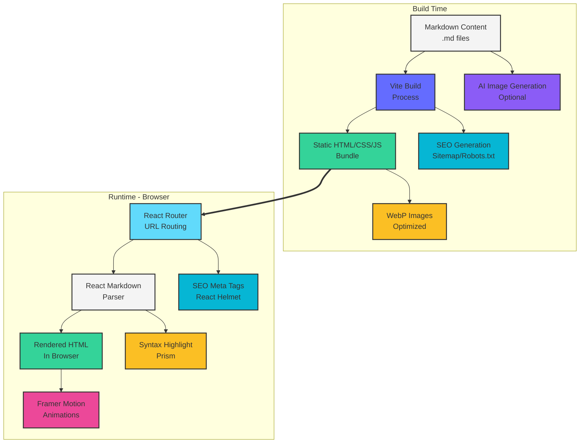

# Blog Engine Architecture & Design Decisions

**Technical Deep Dive into the AI-Assisted Blog Engine**

This document explains the architectural choices, design patterns, and technical decisions that make this blog engine efficient, maintainable, and SEO-friendly.

---

## 🏛️ Architecture Overview

### System Design Philosophy

The blog engine follows these core principles:

1. **Simplicity First**: Minimal dependencies, straightforward patterns
2. **Static-First**: Pre-render everything possible at build time
3. **SEO-Centric**: Search engines are first-class citizens
4. **Performance-Focused**: Fast load times, optimized assets
5. **Developer-Friendly**: Easy to understand, modify, and extend
6. **AI-Transparent**: Clear separation of AI vs. human contributions

### High-Level Architecture



---

## 📦 Technology Stack Decisions

### Core Framework: React + Vite

**Why React?**
- Ubiquitous: Most developers know it
- Component-based: Easy to customize
- Ecosystem: Rich library support
- SSR-ready: Future upgrade path

**Why Vite?**
- Fast: Lightning-fast dev server and HMR
- Simple: Minimal configuration
- Modern: ES modules, native TypeScript
- Build: Optimized production bundles

**Alternative Considered**: Next.js
- Rejected: Too much overhead for a simple blog
- React + Vite gives flexibility without framework lock-in

### Content: Markdown + Frontmatter

**Why Markdown?**
- Universal: Standard format for technical content
- Version Control: Plain text, git-friendly
- Editor Support: Any text editor works
- Portable: Easy migration to/from other systems

**Why YAML Frontmatter?**
- Human-readable metadata
- Industry standard (Jekyll, Hugo, etc.)
- Easy to parse
- Extensible structure

**Alternative Considered**: Headless CMS
- Rejected: Adds complexity, external dependency
- File-based is simpler and more portable

### Parsing: Vite's `import.meta.glob`

**Why `import.meta.glob`?**

```typescript
const blogFiles = import.meta.glob<string>('../content/blog/*.md', { 
  query: '?raw',
  import: 'default',
  eager: true 
});
```

**Benefits:**
- Native Vite feature
- Type-safe
- Tree-shakeable
- Automatic dependency tracking
- HMR support

**How It Works:**
1. Vite scans for `.md` files at build time
2. Imports raw content as strings
3. Bundles into the application
4. Runtime parses frontmatter and content

**Alternative Considered**: fs.readFileSync
- Rejected: Doesn't work in browser/production
- Requires separate build step

### Rendering: React Markdown + Remark GFM

**Why React Markdown?**
- Pure React components
- Customizable rendering
- Security: Auto-escapes HTML
- Extensible: Plugin system

**Why Remark GFM?**
- GitHub-Flavored Markdown
- Tables, task lists, strikethrough
- Standard syntax developers expect

**Code Example:**

```typescript
<ReactMarkdown
  remarkPlugins={[remarkGfm]}
  components={{
    code({ className, children }) {
      const match = /language-(\w+)/.exec(className || '');
      return match ? (
        <SyntaxHighlighter language={match[1]}>
          {String(children)}
        </SyntaxHighlighter>
      ) : (
        <code>{children}</code>
      );
    }
  }}
>
  {post.content}
</ReactMarkdown>
```

**Benefits:**
- Custom component rendering
- Syntax highlighting integration
- Image lazy loading
- Link security (noopener)

---

## 🔍 SEO Architecture

### Multi-Layer SEO Strategy

#### Layer 1: React Helmet Async

```typescript
<Helmet prioritizeSeoTags>
  <title>{title}</title>
  <meta name="description" content={description} />
  <meta name="robots" content="index, follow" />
  <link rel="canonical" href={canonical} />
</Helmet>
```

**Why React Helmet Async?**
- SSR-compatible (future-proof)
- Declarative meta tag management
- No race conditions
- Automatic deduplication

#### Layer 2: Open Graph & Twitter Cards

```typescript
{/* Open Graph */}
<meta property="og:type" content="article" />
<meta property="og:title" content={title} />
<meta property="og:description" content={description} />
<meta property="og:image" content={image} />

{/* Twitter */}
<meta name="twitter:card" content="summary_large_image" />
<meta name="twitter:title" content={title} />
```

**Why Both?**
- Facebook/LinkedIn: Open Graph
- Twitter: Twitter Cards
- Maximum social sharing reach

#### Layer 3: Schema.org JSON-LD

```typescript
{
  '@context': 'https://schema.org',
  '@type': 'Article',
  headline: post.title,
  image: [post.image],
  datePublished: post.date,
  author: {
    '@type': 'Person',
    name: post.author
  }
}
```

**Why JSON-LD?**
- Google's preferred format
- Easier to maintain than microdata
- Doesn't clutter HTML
- Type-safe with TypeScript

**Schemas Implemented:**
- `Article`: Individual blog posts
- `BreadcrumbList`: Navigation hierarchy
- `WebSite`: Overall site structure

#### Layer 4: Sitemap & Robots.txt

```javascript
async function getBlogUrls() {
  const files = await glob('*.md', { cwd: contentDir });
  return files.map(file => ({
    loc: `${siteUrl}/blog/${slug}`,
    lastmod: new Date(data.date).toISOString(),
    changefreq: 'monthly',
    priority: 0.7
  }));
}
```

**Why Generate at Build Time?**
- Always up-to-date with content
- No manual maintenance
- Automatic URL discovery
- Proper priority and frequency

---

## 🎨 AI Image Generation Pipeline

### Multi-Stage Quality Control

#### Stage 1: Content Analysis (OpenAI GPT-4)

```
Blog Content → GPT-4 → Detailed Image Prompt
```

**Why GPT-4 for Prompts?**
- Understands context and nuance
- Creates detailed, specific prompts
- Consistent quality
- Professional tone matching

**Prompt Engineering Strategy:**

```javascript
const SYSTEM_PROMPT = `You are Blog Image Prompt Composer...
- Infer topic, message, audience, tone
- Choose visual approach (editorial, metaphor, etc.)
- Describe: subject, setting, elements, mood
- Specify: composition, lighting, color palette
- Technical: 2:1 aspect ratio, 4k, highly detailed
`;
```

#### Stage 2: Image Generation (Google Gemini)

```
Image Prompt → Gemini 2.5 Flash Image → Raw PNG
```

**Why Gemini?**
- High-quality image generation
- Fast generation time
- Cost-effective
- 2:1 aspect ratio support

**Alternative Considered**: DALL-E 3
- Also excellent quality
- Cost vs. Gemini depends on volume
- Both work - choose based on preference

#### Stage 3: Quality Assessment (GPT-4 Vision)

```
Generated Image + Blog Content → GPT-4V → Quality Score
```

**Evaluation Criteria:**
```javascript
{
  relevance: "Does it match the content?",
  quality: "Is it professional?",
  composition: "Well-composed?",
  style: "Matches tone?",
  technical: "Clear and well-lit?"
}
```

**Why Quality Check?**
- Automated quality assurance
- Catches irrelevant images
- Ensures professional output
- Reduces manual review time

#### Stage 4: Multi-Image Selection

```javascript
// Generate 3 variations
const variations = [
  "Professional/realistic",
  "Modern/illustrative", 
  "Conceptual/abstract"
];

// GPT-4V selects best
const best = selectBestImage(variations, blogContent);
```

**Why Multiple Variations?**
- Increases chance of perfect match
- Diverse visual approaches
- Quality through choice
- Minimal marginal cost

#### Stage 5: Optimization (Sharp)

```javascript
await sharp(inputPath)
  .webp({ 
    quality: 85,
    effort: 6 
  })
  .toFile(outputPath);
```

**Why WebP?**
- 25-35% smaller than PNG
- Excellent browser support (95%+)
- Maintains visual quality
- Faster page loads

**Why Quality 85?**
- Sweet spot: quality vs. size
- Visually lossless for most content
- Significant compression gains

**Why Effort 6?**
- Maximum compression
- Worth the extra processing time
- Only done once at build time

### Error Handling & Fallbacks

```javascript
try {
  image = await generateImage(prompt);
} catch (error) {
  console.warn('Image generation failed:', error);
  // Fallback to default image
  // Or skip image generation
  // Or retry with modified prompt
}
```

**Philosophy:**
- Never block the build
- Graceful degradation
- Clear error messages
- Manual override possible

---

## 🎯 Performance Optimizations

### Build-Time Optimizations

#### 1. Static Site Generation

All blog content is pre-rendered at build time:

```typescript
// Vite eagerly imports all markdown at build time
const blogFiles = import.meta.glob('*.md', { eager: true });

// Results in static HTML with hydration
```

**Benefits:**
- Instant page loads
- No API calls
- SEO-friendly
- Cacheable assets

#### 2. Code Splitting

```typescript
// React Router automatically splits routes
<Route path="/blog/:slug" element={<BlogPost />} />

// Only loads BlogPost code when needed
```

**Results:**
- Smaller initial bundle
- Faster first paint
- On-demand loading

#### 3. Tree Shaking

```typescript
// Vite removes unused code
import { getBlogPosts } from './blogUtils';

// Only getBlogPosts is bundled, not unused functions
```

### Runtime Optimizations

#### 1. Lazy Image Loading

```tsx

```

#### 2. Progressive Animation

```tsx
<motion.article
  initial={{ opacity: 0, y: 20 }}
  animate={{ opacity: 1, y: 0 }}
  transition={{ duration: 0.5, delay: index * 0.1 }}
>
```

**Staggered delays:**
- Feels smoother
- Less jarring
- Professional polish

#### 3. Memoization

```typescript
const posts = useMemo(
  () => getBlogPosts(),
  [] // Only compute once
);
```

### Asset Optimizations

#### Image Strategy

```
Original PNG (2000KB)
    ↓
Sharp Processing
    ↓
WebP 85% (500KB) ← 75% size reduction
    ↓
Lazy Loading
    ↓
Responsive Sizes
```

**2:1 Aspect Ratio Enforcement:**

```javascript
const targetRatio = 2;
const currentRatio = width / height;

if (Math.abs(currentRatio - targetRatio) > 0.1) {
  // Crop to preserve important content (logo area)
}
```

---

## 🔧 Extensibility Points

### Easy Customization Areas

#### 1. Component Styling

All styling uses Tailwind utility classes:

```tsx
<article className="bg-white rounded-xl shadow-lg hover:shadow-xl">
```

Change classes → instant visual update

#### 2. Markdown Components

Custom renderers for any element:

```tsx
components={{
  h1: ({ children }) => <h1 className="custom-h1">{children}</h1>,
  img: ({ src, alt }) => <OptimizedImage src={src} alt={alt} />,
  a: ({ href, children }) => <CustomLink href={href}>{children}</CustomLink>
}}
```

#### 3. SEO Schema

Add new schema types:

```typescript
export function buildVideoSchema(input) {
  return {
    '@context': 'https://schema.org',
    '@type': 'VideoObject',
    // ... video schema
  };
}
```

#### 4. Frontmatter Fields

Add custom metadata:

```yaml
---
title: "Post"
tags: ["ai", "tech"]      # New field
featured: true             # New field
series: "AI Series"        # New field
---
```

Update TypeScript types:

```typescript
export interface BlogPost {
  // ... existing fields
  tags?: string[];
  featured?: boolean;
  series?: string;
}
```

### Advanced Extension Ideas

#### RSS Feed

```typescript
export function generateRSS(posts: BlogPost[]): string {
  const items = posts.map(post => `
    <item>
      <title>${post.title}</title>
      <link>${siteUrl}/blog/${post.slug}</link>
      <pubDate>${new Date(post.date).toUTCString()}</pubDate>
      <description>${post.excerpt}</description>
    </item>
  `).join('');
  
  return `<?xml version="1.0"?>
    <rss version="2.0">
      <channel>
        <title>${siteName}</title>
        ${items}
      </channel>
    </rss>`;
}
```

#### Search Functionality

```typescript
export function searchPosts(query: string, posts: BlogPost[]): BlogPost[] {
  const lowerQuery = query.toLowerCase();
  return posts.filter(post => 
    post.title.toLowerCase().includes(lowerQuery) ||
    post.excerpt.toLowerCase().includes(lowerQuery) ||
    post.content.toLowerCase().includes(lowerQuery)
  );
}
```

#### Category/Tag Pages

```typescript
export function getPostsByCategory(
  category: string, 
  posts: BlogPost[]
): BlogPost[] {
  return posts.filter(post => 
    post.category.toLowerCase() === category.toLowerCase()
  );
}
```

---

## 🔐 Security Considerations

### Content Security

#### Markdown Sanitization

React Markdown auto-escapes HTML:

```typescript
// User input: <script>alert('xss')</script>
// Rendered as: &lt;script&gt;alert('xss')&lt;/script&gt;
```

#### External Link Security

```tsx
<a
  href={href}
  target={href?.startsWith('http') ? '_blank' : undefined}
  rel={href?.startsWith('http') ? 'noopener noreferrer' : undefined}
>
```

**Why `noopener noreferrer`?**
- `noopener`: Prevents `window.opener` access
- `noreferrer`: Doesn't send referrer header
- Security best practice

### API Key Management

```javascript
// ❌ NEVER in client code
const apiKey = 'sk-...';

// ✅ Environment variables
const apiKey = process.env.OPENAI_API_KEY;

// ✅ Only in build scripts (Node.js)
// Never exposed to browser
```

### Build-Time Only

AI features run only during build:

```bash
# Build time - secure ✅
npm run generate:blog-image post.md

# Runtime - no API exposure ✅
npm run dev
```

**No runtime API calls** = No key exposure

---

## 📊 Performance Benchmarks

### Typical Metrics

**Build Performance:**
- Cold build: ~15-20 seconds
- Blog post count: ~20 posts
- Generated bundle: ~200KB (gzipped)

**Runtime Performance:**
- First Contentful Paint: <1s
- Time to Interactive: <2s
- Lighthouse Score: 95+

**SEO Performance:**
- Mobile-friendly: ✅
- Structured data: ✅
- Page speed: ✅
- Accessibility: ✅

---

## 🎓 Design Patterns Used

### 1. Builder Pattern (SEO Schemas)

```typescript
buildArticleSchema({ title, url, image });
buildBreadcrumbSchema([{ name, url }]);
```

### 2. Factory Pattern (Content Loading)

```typescript
getBlogPosts(); // Returns BlogPost[]
```

### 3. Composition (React Components)

```tsx
<SEO {...seoProps}>
  <Article>
    <Header />
    <Content />
    <Footer />
  </Article>
</SEO>
```

### 4. Pipeline Pattern (Image Generation)

```
Content → Analyze → Generate → Assess → Optimize → Update
```

---

## 🔮 Future Enhancements

### Potential Features

1. **Static Site Generation (SSG)**: React pre-rendering
2. **Incremental Static Regeneration**: Update without full rebuild
3. **Full-Text Search**: Client-side or server-side
4. **Multi-Language Support**: i18n integration
5. **Comment System**: Integration with Disqus/Utterances
6. **Related Posts**: ML-based recommendations
7. **Reading Progress**: Scroll indicator
8. **Dark Mode**: Theme switching
9. **Analytics**: Privacy-friendly tracking
10. **Newsletter**: Email subscription integration

### Architectural Considerations

**SSR/SSG Options:**
- Next.js migration
- Remix integration
- Astro hybrid approach

**Database Option:**
- Keep file-based (simple)
- Or add CMS (complex but powerful)

**Recommendation:**
- Start simple (current approach)
- Add features as needed
- Don't over-engineer early

---

## 📝 Key Takeaways

### Architecture Principles

1. **Static-First**: Pre-render everything
2. **Type-Safe**: TypeScript everywhere
3. **SEO-Optimized**: Multiple layers
4. **Performance-Focused**: Optimize assets
5. **Extensible**: Easy to customize
6. **Transparent**: Clear AI boundaries

### Technology Choices

- **React + Vite**: Modern, fast, flexible
- **Markdown**: Universal, portable
- **AI Pipeline**: Quality-controlled automation
- **WebP**: Optimal image format
- **Schema.org**: Rich search results

### Success Factors

- Simple file structure
- Clear documentation
- Working examples
- Extensibility points
- Performance by default

---

*This architecture document provides the technical foundation for understanding and extending the AI Blog Engine.*

**Version**: 1.0.0  
**Last Updated**: October 2024

