# Blog Engine Documentation Index

**Complete Documentation Suite for the Open Source AI Blog Engine**

---

## 📚 Documentation Overview

This documentation suite provides everything you need to understand, deploy, and customize the AI-assisted blog engine.

### Document Hierarchy

```mermaid
graph TD
    Root[📚 Blog Engine Docs]
    Root --> README[🏠 README - Main Documentation]
    Root --> Quick[⚡ Quick Start Guide]
    Root --> Arch[🏗️ Architecture Document]
    Root --> Index[📋 This Index]
    
    README --> READMEDesc[Complete feature overview,<br/>usage guide, and API reference]
    Quick --> QuickDesc[Get running in 5 minutes]
    Arch --> ArchDesc[Technical deep dive<br/>and design decisions]
    Index --> IndexDesc[Navigation and<br/>documentation roadmap]
    
    style Root fill:#8b5cf6,stroke:#333,stroke-width:3px,color:#fff
    style README fill:#61dafb,stroke:#333,stroke-width:2px
    style Quick fill:#fbbf24,stroke:#333,stroke-width:2px
    style Arch fill:#06b6d4,stroke:#333,stroke-width:2px
    style Index fill:#34d399,stroke:#333,stroke-width:2px
    style READMEDesc fill:#f4f4f4,stroke:#ddd,stroke-width:1px
    style QuickDesc fill:#f4f4f4,stroke:#ddd,stroke-width:1px
    style ArchDesc fill:#f4f4f4,stroke:#ddd,stroke-width:1px
    style IndexDesc fill:#f4f4f4,stroke:#ddd,stroke-width:1px
```



---

## 📖 Documentation Files

### 1. Main README (`README.md`)

**Primary documentation for end users and developers**

**Sections:**
- Purpose & Philosophy
- Architecture Overview
- File Structure
- Blog Post Structure
- AI Image Generation Workflow
- SEO Implementation
- Content Management
- UI Components
- Getting Started
- Performance Optimizations
- Customization Guide
- Dependencies
- Security
- Contributing
- FAQ

**Best For:**
- First-time users
- Feature exploration
- API reference
- General understanding

**Start Here If:**
- You're new to the blog engine
- You want to understand capabilities
- You need code examples
- You're evaluating the project

---

### 2. Quick Start Guide (`docs/QUICK_START.md`)

**5-minute setup and first post guide**

**Sections:**
- Quick Installation
- Create Your First Blog Post
- Frontmatter Reference
- Build & Deploy
- Available Commands
- Configuration
- File Structure
- Common Tasks
- Troubleshooting
- Pro Tips

**Best For:**
- Getting started quickly
- Creating first post
- Common configurations
- Quick reference

**Start Here If:**
- You want to start writing immediately
- You need a command reference
- You're troubleshooting issues
- You want quick tips

---

### 3. Architecture Document (`docs/ARCHITECTURE.md`)

**Technical deep dive into design decisions and implementation**

**Sections:**
- Architecture Overview
- System Design Philosophy
- Technology Stack Decisions
- SEO Architecture (Multi-Layer)
- AI Image Generation Pipeline
- Performance Optimizations
- Extensibility Points
- Security Considerations
- Performance Benchmarks
- Design Patterns
- Future Enhancements

**Best For:**
- Understanding design decisions
- Technical evaluation
- Contributing code
- Extending functionality

**Start Here If:**
- You want to understand "why"
- You're evaluating technology choices
- You're planning to contribute
- You need to extend the engine

---

## 🗺️ Documentation Roadmap

### By User Type

#### For **Content Creators**

1. Read: Quick Start Guide
2. Focus: Creating blog posts, frontmatter, images
3. Optional: Architecture Document (if curious about internals)

#### For **Developers** (Using as-is)

1. Read: Main README
2. Read: Quick Start Guide
3. Skim: Architecture Document (for context)

#### For **Contributors** (Extending)

1. Read: Main README
2. Read: Architecture Document
3. Read: Quick Start Guide
4. Review: CONTRIBUTING.md guidelines

#### For **Open Source Contributors**

1. Read: Main README (comprehensive overview)
2. Read: Architecture Document (understand design)
3. Use: Quick Start (learn the basics)
4. Create: Pull requests following CONTRIBUTING.md

---

## 📑 Quick Reference

### Installation

```bash
git clone https://github.com/your-org/blog-engine.git
cd blog-engine
npm install
npm run dev
```

**Details**: Quick Start Guide → Installation

### Creating a Post

```markdown
---
title: "Your Title"
excerpt: "Brief description"
author: "Your Name"
date: "2024-01-15"
category: "Category"
readTime: "5 min read"
image: /images/blog/your-image.webp
---

# Your Content Here
```

**Details**: Main README → Blog Post Structure

### AI Image Generation

```bash
npm run generate:blog-image src/content/blog/your-post.md
```

**Details**: Main README → AI Image Generation

### SEO Configuration

Edit `src/seo/config.ts`:

```typescript
export const siteUrl = 'https://yourdomain.com';
export const siteName = 'Your Blog';
```

**Details**: Quick Start Guide → Configuration

### Building for Production

```bash
npm run seo:gen
npm run build
```

**Details**: Quick Start Guide → Build & Deploy

---

## 🎯 Common Use Cases

### Use Case 1: "I want to start blogging today"

**Path:**
1. Quick Start Guide → Installation
2. Quick Start Guide → Create Your First Blog Post
3. Quick Start Guide → Available Commands

**Time**: 10 minutes

---

### Use Case 2: "I want to understand how this works"

**Path:**
1. Main README → Architecture Overview
2. Architecture Document → System Design
3. Main README → Code Examples

**Time**: 30 minutes

---

### Use Case 3: "I want to customize the design"

**Path:**
1. Main README → Customization Guide
2. Quick Start Guide → Configuration
3. Architecture Document → Extensibility Points

**Time**: 20 minutes

---

### Use Case 4: "I want to open source this for my company"

**Path:**
1. Extraction Guide → Full walkthrough
2. Main README → For reference content
3. Quick Start Guide → For user documentation

**Time**: 2-3 hours

---

### Use Case 5: "I want to contribute improvements"

**Path:**
1. Architecture Document → Design Patterns
2. Main README → Code Structure
3. Extraction Guide → Clean Code Principles

**Time**: 45 minutes

---

## 🔍 Search by Topic

### AI & Image Generation

- Main README → AI-Powered Image Generation
- Architecture Document → AI Image Generation Pipeline
- Quick Start Guide → AI-Generated Image option

### SEO Optimization

- Main README → SEO Implementation
- Architecture Document → SEO Architecture
- Quick Start Guide → SEO Generation

### Performance

- Architecture Document → Performance Optimizations
- Main README → Performance Optimizations
- Quick Start Guide → Pro Tips

### Customization

- Main README → Customization Guide
- Architecture Document → Extensibility Points
- Quick Start Guide → Configuration

### Security

- Main README → Security Considerations
- Architecture Document → Security Considerations
- Extraction Guide → Removing Sensitive Data

### Deployment

- Quick Start Guide → Build & Deploy
- Extraction Guide → Testing & Publishing
- Main README → Getting Started

---

## 📊 Documentation Statistics

| Document | Words | Sections | Code Examples | Use Case |
|----------|-------|----------|---------------|----------|
| Main README | ~6,000 | 20+ | 50+ | Comprehensive Reference |
| Quick Start | ~1,500 | 12 | 20+ | Rapid Onboarding |
| Architecture | ~4,500 | 12 | 40+ | Technical Deep Dive |
| **Total** | **~12,000** | **44** | **110+** | Complete Coverage |

---

## 🎓 Learning Path

### Beginner Path (First Time Users)

```
Day 1: Quick Start Guide
  ↓
Day 2: Create 2-3 blog posts
  ↓
Day 3: Main README (Skim)
  ↓
Week 2: Customize styling
```

### Intermediate Path (Developers)

```
Week 1: Main README + Quick Start
  ↓
Week 2: Architecture Document
  ↓
Week 3: Extend with custom features
  ↓
Week 4: Contribute back
```

### Advanced Path (Contributors)

```
Day 1: All Documentation
  ↓
Day 2-3: Code Review
  ↓
Week 2: Architecture Deep Dive
  ↓
Week 3+: Major Contributions
```

---

## 🛠️ Maintenance

### Keeping Documentation Updated

When updating the blog engine:

1. **Code Changes** → Update Architecture Document
2. **New Features** → Update Main README
3. **Bug Fixes** → Update Troubleshooting in Quick Start
4. **API Changes** → Update all code examples
5. **New Dependencies** → Update Main README

### Version Tracking

Each document includes:
- Version number
- Last updated date
- Major change log (if applicable)

---

## 🤝 Contributing to Documentation

### Documentation Improvements Needed

- [ ] Video tutorials
- [ ] Interactive examples
- [ ] More troubleshooting scenarios
- [ ] Deployment-specific guides
- [ ] Migration guides from other platforms

### How to Contribute

1. Identify gap or improvement
2. Create issue on GitHub
3. Fork repository
4. Make changes
5. Submit pull request

---

## 📞 Getting Help

### Documentation Not Enough?

**Option 1**: GitHub Issues
- Search existing issues
- Create new issue with `[docs]` tag

**Option 2**: GitHub Discussions
- Ask questions
- Share use cases
- Request clarifications

**Option 3**: Community
- Share your implementation
- Help others
- Improve docs

---

## ✅ Documentation Checklist

Use this when setting up your own blog engine:

**Pre-Setup**
- [ ] Read Quick Start Guide
- [ ] Review Main README
- [ ] Check system requirements

**During Setup**
- [ ] Follow installation steps
- [ ] Create first blog post
- [ ] Test build process

**After Setup**
- [ ] Customize configuration
- [ ] Review SEO settings
- [ ] Test on mobile

**Going Further**
- [ ] Read Architecture Document
- [ ] Explore customization options
- [ ] Consider contributing

---

## 🎯 Next Steps

### If You're New Here

1. **Start**: Quick Start Guide
2. **Explore**: Main README
3. **Build**: Create your first post
4. **Share**: Deploy and publish

### If You're Ready to Open Source

1. **Plan**: Extraction Guide
2. **Execute**: Follow step-by-step
3. **Polish**: Review all documentation
4. **Launch**: Publish to GitHub

### If You Want to Contribute

1. **Learn**: Architecture Document
2. **Understand**: Main README
3. **Code**: Create improvements
4. **Submit**: Pull request

---

## 📚 External Resources

### Related Documentation

- [React Documentation](https://react.dev)
- [Vite Documentation](https://vitejs.dev)
- [Tailwind CSS](https://tailwindcss.com)
- [React Markdown](https://github.com/remarkjs/react-markdown)
- [Schema.org](https://schema.org)

### AI Documentation

- [OpenAI API](https://platform.openai.com/docs)
- [Google Gemini](https://ai.google.dev/docs)
- [Sharp Image Processing](https://sharp.pixelplumbing.com)

### SEO Resources

- [Google Search Central](https://developers.google.com/search)
- [Schema.org Validator](https://validator.schema.org)
- [Open Graph Protocol](https://ogp.me)

---

## 🎉 Summary

This documentation suite provides:

✅ **Comprehensive Coverage**: All aspects of the blog engine  
✅ **Multiple Audiences**: Content creators to developers  
✅ **Practical Examples**: 140+ code snippets  
✅ **Step-by-Step Guides**: Clear instructions  
✅ **Technical Depth**: Architecture and decisions  
✅ **Open Source Ready**: Extraction guide included  

**Total Documentation**: 16,000+ words across 4 primary documents

**Start Your Journey**: Pick the document that matches your goal and dive in!

---

*Last Updated: October 2024*  
*Version: 1.0.0*

**Questions?** Open an issue on GitHub or check the FAQ in the Main README.

